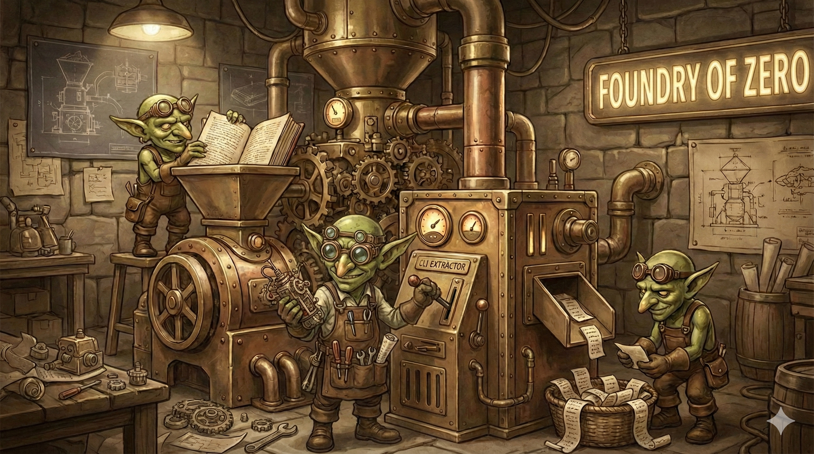

__[WARNING]__
# THIS IS EXPERIMENTAL SOFTWARE
I wrangled this tool with AI because reading Curturally Responsive Computing for my course, in full, would be too painful. Literally. My brain would melt. It is a quarter knowledge with verbose ages old human pain as a remainder. I don't have space for all the violins in my head.

`aqe` turned out quite useful so far, though, and gave me ideas on how to scale this. It is agent use friendly ;) Just like any CLI.

The tested parts work and wrangling is ongoing - see [Project Status](STATUS.md)

Keep building,

NiXLiM

__[WARNING]__

---



# Academic Quote Extractor (aqe)

A Go CLI application for extracting relevant quotes from academic documents with Harvard-style citations. Designed for students who need to find quotable passages for essays and research papers.

## How It Works

AQE uses a hybrid RAG (Retrieval-Augmented Generation) architecture:

1. **Ingest** -- Parse PDF, DOCX, or TXT documents via a local Docling Python subprocess, chunk them with `HybridChunker` (~800-token chunks with 200-token overlap), generate vector embeddings via Ollama, and store verbatim text in SQLite.
2. **Extract** -- Given a research topic, perform hybrid BM25 + vector search in Weaviate, send top candidates to Claude for relevance scoring, and save results.
3. **Export** -- Output saved extractions as Markdown (with blockquotes and bibliography), JSON, or BibTeX.

**Zero hallucination guarantee**: The LLM returns only chunk IDs and relevance scores. Quote text is always retrieved verbatim from SQLite -- never generated by the LLM.

## Quick Example

```bash
# Start services (Weaviate + Ollama)
docker compose up -d
docker exec -it ollama ollama pull nomic-embed-text

# Install Python dependencies for local Docling
pip3 install -r scripts/requirements.txt

# Build
go build -o aqe ./cmd/aqe

# Ingest a document with metadata
./aqe ingest "my-paper.pdf" \
  --title "Culturally Responsive Computing" \
  --author "Walton, Devan J." \
  --year 2024
# => Processing: my-paper.pdf
# => Ingested 1 documents, 2920 chunks

# Extract quotes on a topic (saves with an auto-assigned ID)
./aqe extract "cultural bias in technology and algorithms"
# => Searching for relevant quotes...
# => Found 50 candidate chunks
# => Scoring relevance with Claude...
# =>
# => Extraction #1: "cultural bias in technology and algorithms"
# => Retrieved 20 quotes (relevance >= 60)
# =>
# => Quote 1 (Relevance: 92/100)
# => ━━━━━━━━━━━━━━━━━━━━━━━━━━━━━━━━━━━━━━━━
# => "Despite their seemingly objective nature, algorithms can, and often do,
# =>  reflect the biases of their creators..."
# =>
# => — (Walton, 2024)
# => ...
# => Saved as extraction #1. Export with: aqe export 1

# List saved extractions to see IDs
./aqe list
# => Saved Extractions:
# =>
# =>   #1: "cultural bias in technology and algorithms"
# =>       20 quotes | 2026-01-30
# =>       Export: aqe export 1

# Export using the extraction ID from above
./aqe export 1 --format markdown --output quotes.md
# => Exported to quotes.md
```

## Documentation

- **[User Quickstart](USERS_QUICKSTART.md)** -- Install prerequisites, start services, and run your first extraction in minutes.
- **[Developer Quickstart](DEV_QUICKSTART.md)** -- Set up the development environment, understand the architecture, run tests, and contribute.
- **[CLI Reference](CLI_REFERENCE.md)** -- Complete reference for all commands, flags, output formats, error handling, and worked examples.
- **[Project Status](STATUS.md)** -- Known limitations, untested features, incomplete tasks, hardcoded values, and areas needing work.
- **[Contributors](CONTRIBUTORS.md)** -- Project contributors and how to contribute.

### Architecture Diagrams

- **[Implementation Architecture](implementation-architecture.mermaid)** -- As-built component layout showing Go packages, Docker services, and data flow.
- **[Implemented Flow](implemented-flow.mermaid)** -- Sequence diagram of the actual implemented data flow for all phases (ingest, extract, list, export, meta fix), annotated with real code paths and known fallbacks.

## CLI Commands

| Command | Description |
|---------|-------------|
| `aqe ingest <path>` | Parse and index documents for quote extraction |
| `aqe extract <topic>` | Find relevant quotes for a research topic |
| `aqe export <id>` | Export a saved extraction (Markdown, JSON, BibTeX) |
| `aqe list` | List all saved extractions |
| `aqe meta fix` | Interactively fix missing document metadata |
| `aqe reindex` | Rebuild the Weaviate vector index from SQLite (drops + recreates the Chunk class, re-embeds every chunk) |
| `aqe status` | Show infrastructure and database status |

Run `./aqe --help` or `./aqe <command> --help` for built-in usage. See [CLI Reference](CLI_REFERENCE.md) for the full reference with examples and error handling.

## Architecture Overview

```
                          +------------------+
                          |   CLI (Cobra)    |
                          +--------+---------+
                                   |
              +--------------------+--------------------+
              |                    |                     |
     +--------v-------+  +--------v--------+  +--------v--------+
     |   Ingest Flow  |  |  Extract Flow   |  |  Export Flow     |
     +--------+-------+  +--------+--------+  +--------+--------+
              |                    |                     |
  +-----------+----------+   +----+----+          +-----+-----+
  | Docling + HybridChunker  |Weaviate |          |  SQLite   |
  | (local Python subprocess)|(search) |          |  (data)   |
  +-----------+----------+   +----+----+          +-----+-----+
                                  |
                            +-----+------+
                            | Claude CLI |
                            | (scoring)  |
                            +------------+
```

**Services** (Docker):
- **Weaviate** -- Vector database with hybrid BM25 + semantic search
- **Ollama** -- Local embedding generation (nomic-embed-text, 768 dimensions). Alternatively use a host-side Ollama for Metal GPU acceleration (see [Developer Quickstart](DEV_QUICKSTART.md)).

**Local Python subprocess**:
- **Docling + HybridChunker** -- Document parsing (PDF, DOCX, TXT) with layout analysis and token-aware chunking. Invoked by the Go ingest flow via `scripts/process_document.py`.

**Embedded**:
- **SQLite** -- Stores documents, chunks, extractions, and quote text
- **Claude CLI** -- Relevance scoring and explanation generation

## Output Formats

### Markdown
Produces blockquotes with in-text citations, relevance scores, and a bibliography section.

### JSON
Structured output with quotes, references, relevance scores, and document metadata.

### BibTeX
Standard BibTeX bibliography entries for all cited sources.

## Requirements

### Account

- **Claude Code** -- You need an active [Claude Code](https://claude.ai/code) subscription. AQE calls the `claude` CLI during the extraction phase to score quote relevance. Without it, ingestion and search still work, but extraction will fail.

### Software

| Requirement | Version | What it does | Install |
|---|---|---|---|
| **Go** | 1.25+ | Builds and runs the CLI. CGO must be enabled (`CGO_ENABLED=1`) because SQLite uses a C driver. | [go.dev/dl](https://go.dev/dl/) |
| **Docker** | 20.10+ | Runs Weaviate and Ollama as containers (Docling runs as a local Python subprocess, not in Docker). | [docs.docker.com](https://docs.docker.com/get-docker/) |
| **Docker Compose** | 2.0+ | Orchestrates Weaviate + Ollama from the included `docker-compose.yml`. | Included with Docker Desktop, or install the plugin separately. |
| **Python 3** | 3.11+ | Runs the Docling parsing + `HybridChunker` pipeline (`scripts/process_document.py`) as a local subprocess. | [python.org](https://www.python.org/downloads/) |
| **Claude CLI** | Latest | Scores candidate chunks for relevance during extraction. Must be authenticated and available in your PATH. | `npm install -g @anthropic-ai/claude-code` |

### Python packages

The local ingest pipeline (Docling + `HybridChunker`) needs the dependencies pinned in `scripts/requirements.txt`:

```bash
pip3 install -r scripts/requirements.txt
```

This installs `docling>=2.70.0`, `docling-core>=2.61.0`, `transformers>=4.0.0`, and `sentence-transformers>=2.0.0`.

### Verify your setup

```bash
go version                  # go1.25 or later
docker --version            # 20.10 or later
docker compose version      # 2.0 or later
python3 --version           # 3.9 or later
claude --version            # any recent version
```

All five commands should succeed before you proceed to [User Quickstart](USERS_QUICKSTART.md).

## Project Structure

```
cmd/aqe/          CLI entry point
internal/
  cli/            Cobra commands (ingest, extract, export, list, meta, reindex, status)
  docling/        Local Python subprocess wrapper for Docling + HybridChunker (processor.go)
  chunker/        Legacy Python wrapper (deprecated; superseded by docling/processor.go)
  claude/         Claude CLI wrapper, prompt templates, query expansion, batched scoring
  search/         Weaviate client (insert, hybrid search, delete)
  store/          SQLite operations and migrations
  harvard/        Harvard reference formatting (pure Go)
  models/         Domain types (Document, Chunk, Extraction, Quote)
scripts/
  process_document.py   Entry point for parse + chunk + overlap pipeline
  lib/                  parser.py, chunker.py, overlap.py
  requirements.txt      Pinned Python dependencies
tests/
  unit/           Unit tests (no Docker required)
  contract/       API contract tests (require Docker)
  integration/    End-to-end tests (require Docker)
```

## License

This project is licensed under the MIT License. See [LICENSE](LICENSE) for details.

CopyAI (cAI) 2026 NiXLiM @ Foundry of Zero.AI
